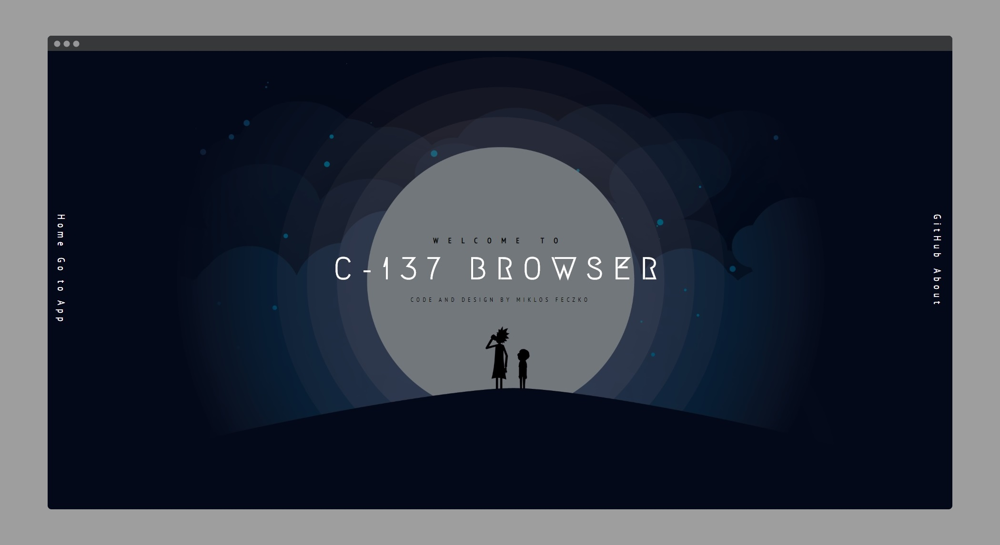
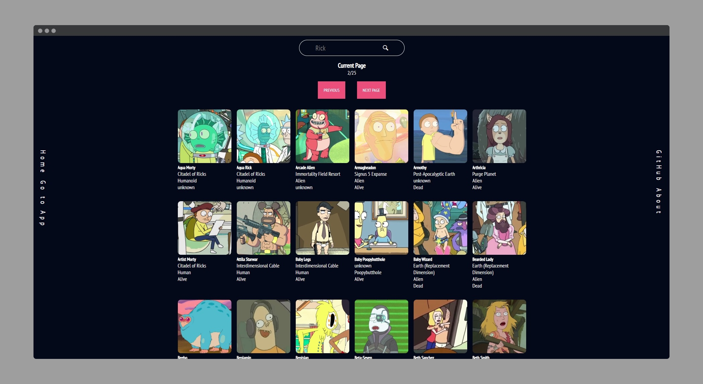

# C-137 Browser

## [Check live demo!](https://miklosfeczko.github.io/c137-browser-vanilla/)

I created this application to participate in the Coding Garden Seedling School 01 - Frontend Project. Users can use the search form to check out character from Rick and Morty.

## How to Use

Click the "To the App" text on the top of the page to use the app. Type a character name from the show correctly then hit enter or click the search icon to submit. If the character exists then it will be listed. If something went wrong the app will show an error message. Happy searching!

## Built With

- Vanilla JS
- Rick and Morty API
- SCSS
